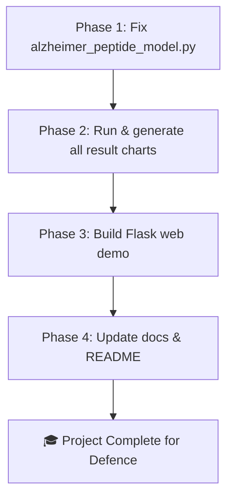

# Final Implementation Plan: Alzheimer's Early Detection Using Peptide Sequences

## Project Status

The core research pipeline is **already working**. Models are trained and saved. The gaps are around **result quality**, **code robustness**, and a **missing interactive demo/UI** for the defence presentation.

---

## What Is Already Done ✅

| Component | Status |
|---|---|
| Data scraping (`download_peptides.py`) | ✅ Complete |
| Dataset (`peptides_data.csv`, `.xlsx`) | ✅ Available |
| ML Models (LR, RF, SVM) | ✅ Trained & saved |
| DL Models (CNN, LSTM, BiLSTM) | ✅ Trained & saved |
| Model comparison chart | ✅ `model_comparison.png` |
| Inference function | ✅ In `alzheimer_peptide_model.py` |
| VIVA study guide | ✅ Done |
| PRD/Research doc | ✅ Done |

---

## What Is Missing / Needs Improvement ⚠️

> [!IMPORTANT]
> These are the gaps that need to be filled to call the project "complete" for a defence submission.

### Gap 1 — Code Quality Issues (High Priority)
- **No k-fold cross-validation** → results may be over/under-estimated
- **Test set is also used as DL validation** (data leakage concern noted in VIVA guide)
- **Confusion matrix is imported but never printed/saved** for all models
- **No ROC-AUC curve** generated anywhere
- **SHAP explainability** exists only for Random Forest (`shap_summary_random_forest.png`), not others
- **No classification report** printed/saved for all models

### Gap 2 — Missing Visualizations
- Confusion matrix plots for all 6 models (not just Logistic Regression)
- ROC-AUC curve plot (all models on one chart)
- Training history plots (loss & accuracy curves) for CNN, LSTM, BiLSTM

### Gap 3 — No Interactive Demo / Web UI
- No demo that allows supervisor/examiner to type a peptide and see a prediction
- A web-based tool would make the defence presentation **very impressive**

### Gap 4 — Missing Final Report Outputs
- No `results/` folder with all charts organized
- No automated summary report (CSV/Excel with all metric numbers)

---

## Proposed Changes

### Phase 1 — Fix & Improve the ML Pipeline

#### [MODIFY] [alzheimer_peptide_model.py](file:///c:/Users/Sheikh%20Shariar%20Nehal/Desktop/DIU/Defience/Poject/alzheimer_peptide_model.py)

- Add **k-fold cross-validation** (5-fold) for all ML models to produce more reliable accuracy estimates
- Fix DL training to use a **proper validation split** (separate from the test set — use 10% of train set)
- Print and save **confusion matrix** for every model
- Add **ROC-AUC score** to the metrics dictionary
- Save **training history plots** (loss/accuracy per epoch) for CNN, LSTM, BiLSTM
- Add a single **ROC-AUC comparison plot** with all 6 models on one figure
- Save all outputs into an organized `results/` folder

---

### Phase 2 — Generate Missing Visualizations

#### [NEW] `results/` folder (auto-created by script)

Contents after running the improved script:
```
results/
  confusion_matrix_logistic_regression.png
  confusion_matrix_random_forest.png
  confusion_matrix_svm.png
  confusion_matrix_cnn.png
  confusion_matrix_lstm.png
  confusion_matrix_bilstm.png
  roc_auc_all_models.png
  training_history_cnn.png
  training_history_lstm.png
  training_history_bilstm.png
  model_comparison.png
  metrics_summary.csv
```

---

### Phase 3 — Interactive Web Demo (Defence Showcase)

#### [NEW] `app.py` — Flask web application

A clean, browser-based prediction tool:
- Input field: user types any peptide sequence (e.g., `KLVFFA`)
- Model selector: dropdown to pick LR / RF / SVM / CNN / LSTM / BiLSTM
- Output: predicted class, probability bar, risk level badge (Low / Medium / High)
- Animated, professional design for the defence demo

#### [NEW] `templates/index.html` — Front-end UI

- Dark mode, modern design
- Animated probability meter
- Real-time prediction on button click

#### [MODIFY] [requirements.txt](file:///c:/Users/Sheikh%20Shariar%20Nehal/Desktop/DIU/Defience/Poject/requirements.txt)

Add: `flask`, `shap` (already partially used)

---

### Phase 4 — Documentation Cleanup

#### [MODIFY] [VIVA_STUDY_GUIDE.md](file:///c:/Users/Sheikh%20Shariar%20Nehal/Desktop/DIU/Defience/Poject/VIVA_STUDY_GUIDE.md)

- Update results table with ROC-AUC scores
- Add answers for k-fold cross-validation questions
- Add section on the web demo

#### [NEW] `README.md`

A proper project README with:
- How to install dependencies
- How to run training
- How to run the web demo
- Sample prediction output

---

## Execution Order



---

## Verification Plan

### Automated
- Run `python alzheimer_peptide_model.py` → confirm all 6 models train, metrics print, all charts saved in `results/`
- Run `python app.py` → confirm Flask server starts on `localhost:5000`

### Manual
- Open browser at `localhost:5000`
- Enter `KLVFFA` → confirm prediction shows **High Risk / Amyloid**
- Enter `AAAQAA` → confirm prediction shows **Low Risk / Non-amyloid**
- Check `results/` folder → confirm all PNG files are generated
- Confirm `metrics_summary.csv` has all 6 models × 5 metrics

---

## Open Questions

> [!NOTE]
> Please confirm these before I start implementing:

1. **Should I add k-fold cross-validation?** It will make training take longer but results will be more credible for the defence.
2. **Do you want the web demo (Flask app)?** This is the most impressive addition for the defence but is optional.
3. **Should I re-train all models** (to fix the DL validation leak) or just add the missing charts/reports to the existing saved models?
